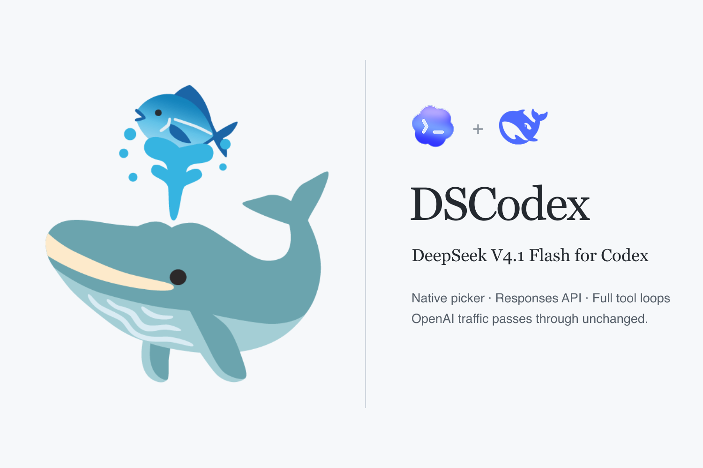

# DSCodex — 在 Codex / ChatGPT 桌面端同时使用 DeepSeek 与 GPT

<div align="center">



<p>
  <a href="https://github.com/fish2lab/DSCodex/releases/latest"></a>
  <a href="https://github.com/fish2lab/DSCodex/stargazers"></a>
  <a href="https://developers.openai.com/codex/"></a>
  <a href="https://api-docs.deepseek.com/zh-cn/guides/responses_api/"></a>
  <br />
  <a href="https://api-docs.deepseek.com/zh-cn/guides/responses_api/"></a>
  <a href="package.json"></a>
  <a href="#环境要求"></a>
  <a href="LICENSE"></a>
</p>

<p><strong>DeepSeek Flash for the stock ChatGPT desktop app, Codex CLI and IDE — native Responses API, full agentic tool loops, no fork.</strong></p>
<p>在原版 ChatGPT 桌面端与 Codex 中使用 DeepSeek Flash，同时保留 GPT OAuth 模型。</p>

</div>

简体中文 · [English](README.en.md)

---

## DSCodex 是什么？

**DSCodex 是一个开源、本地运行的 Codex 多模型路由器。** 它让 DeepSeek Flash 出现在 ChatGPT 桌面端的 Codex 原生模型选择器、Codex CLI 和 IDE 扩展中，同时保留 ChatGPT OAuth 登录与 GPT 模型。DeepSeek 请求使用原生 Responses API；GPT 请求继续通过 `chatgpt.com` OAuth 透明转发。

DSCodex 适合想要 **Codex 接入 DeepSeek**、又不想在 DeepSeek API Key 与 ChatGPT 订阅之间反复改配置或重新登录的用户。它不是 ChatGPT 网页版插件，也不 fork、不 patch ChatGPT 或 Codex App。

### 何时选择 DSCodex？

| 需求 | [DeepSeek 官方 Codex 直连](https://api-docs.deepseek.com/zh-cn/quick_start/agent_integrations/codex/) | DSCodex |
|---|---|---|
| 在 Codex 使用 DeepSeek Flash | 支持 | 支持 |
| 同一客户端保留 GPT OAuth 模型 | 切换到 API Key 登录；恢复配置后切回 | 按模型名路由，DeepSeek 与 GPT 同时留在模型菜单 |
| DeepSeek API Key | 写入 `config.toml` 的 bearer token 字段 | 独立存储于 `~/.codex/dscodex/config.json`（0600；Windows DPAPI） |
| Codex 兼容适配 | 直接连接 DeepSeek | 工具重放、上下文压缩、原生识图与 provider 状态适配 |

## 2026-09-11 更新：V4.1 Flash

模型菜单统一为 `🐳 DeepSeek Flash`，API 名称为 `deepseek-flash`，当前对应 **DeepSeek V4.1 Flash**。官方提供 1M 上下文、最高 384K 输出、原生视觉及 Responses API 工具调用。高峰期每百万 token 的缓存命中输入 / 未命中输入 / 输出价格分别为 **$0.006 / $0.30 / $1.20**，低谷期减半；价格与能力以[官方模型说明](https://api-docs.deepseek.com/quick_start/pricing/)为准。

DeepSeek 宣布于 **2026-09-14 12:00（北京时间）**开始将 V4 Pro 请求转到 V4.1 Flash，并按 Flash 计费。DSCodex 本次已将旧 Flash / Pro 名称统一映射到 Flash，保留旧任务兼容，不修改用户保存的模型设置。“全面超过 V4 Pro”是官方测试结论，本项目未进行独立模型排名评测。

本次还改为直接传递图片，移除路由中的 GPT 代读；修复 DeepSeek → GPT 历史切换及自启动交接失败后的路由恢复。macOS 实测 107 项通过、6 项 Windows 原生测试跳过；真实 shell 工具闭环和原生图片识别通过。已加入 macOS / Windows / Linux CI；Windows 实机兼容与语音 PR #21 仍待验收。

## 快速开始

**环境要求：** macOS / Linux / Windows（原生），Node.js 24.5+，ChatGPT 桌面端或 Codex CLI，DeepSeek API Key。

### 交给 AI Agent 安装（推荐）

克隆仓库后让 Agent 读本 README 或 `AGENTS.md`：

```bash
# 1. 存入 API Key（不打印不进仓库，0600 / Windows DPAPI）
DEEPSEEK_API_KEY=sk-... node src/cli.mjs key set

# 2. 安装、启动、验证
node src/cli.mjs install
node src/cli.mjs start
node src/cli.mjs doctor    # 六项必须全部 ok

# 3. 验证
npm test
```

完全退出（⌘Q）重开 ChatGPT 桌面端，新建任务选择 `🐳 DeepSeek Flash`。

### 手动安装

```bash
node src/cli.mjs key set
node src/cli.mjs proxy set http://127.0.0.1:10808   # 可选
node src/cli.mjs install && node src/cli.mjs start && node src/cli.mjs doctor
node src/cli.mjs autostart enable   # 可选：登录自启；路由崩溃后自动恢复
```

CLI 默认 **High**；加 `-c 'model_reasoning_effort="max"'` 使用 **Max**。

```bash
codex -m deepseek/deepseek-flash -c 'model_reasoning_effort="max"'
```

所有命令：`install` `sync` `key set|status|delete` `proxy set|status|clear` `start` `serve`
`autostart enable|disable|status` `status` `doctor` `stop` `uninstall`

## 架构

```text
Codex App / CLI / IDE
        │  HTTP/SSE（zstd 压缩、OAuth 头）
        ▼
http://127.0.0.1:10110/<router-token>/v1   ← DSCodex 本地路由
        │
        ├── DeepSeek 模型 → api.deepseek.com/responses
        │     （图片原生输入；旧 Flash / Pro 名称兼容映射到 Flash）
        └── 其他模型     → chatgpt.com/backend-api/codex（OAuth 原样转发）
```

按模型名分流。DeepSeek 请求适配其 API；GPT 请求只在包含外来 reasoning 或 DSCodex 压缩项时转换，其余保持原始字节。

## 兼容性

| 场景 | 状态 |
|---|---|
| ChatGPT macOS 桌面端原生模型菜单 | 支持 |
| Codex CLI / IDE 扩展 | 支持 |
| Windows 原生（Codex CLI / IDE 扩展） | 支持 |
| DeepSeek 多轮工具调用（shell / apply_patch / function call / web search） | 原生 Responses API |
| 上下文压缩（自动 / 手动） | 支持 — DeepSeek 摘要加密封装为 Codex 压缩项 |
| GPT / Codex OAuth 模型 | 透明旁路 |
| app-server bridge（桌面端模型菜单状态记忆） | 可选，macOS 专属；默认不启以保 Computer Use |
| chatgpt.com 网页版 | 不支持（接入的是本地 Codex 运行时） |

## 常见问题

### 能在同一个 Codex / ChatGPT 桌面端里同时使用 DeepSeek 和 GPT 吗？

能。模型菜单保留 GPT，并新增 `🐳 DeepSeek Flash`；路由器按模型名选择 DeepSeek API 或 ChatGPT OAuth，不需要为每次切换重写 provider。

### 支持 Codex CLI、IDE 和 Windows 吗？

支持。Codex CLI 与 IDE 扩展支持 macOS、Linux、Windows；ChatGPT 桌面端的原生模型菜单集成当前以 macOS 为主。Windows 桌面端不支持可选的 app-server bridge，但 CLI / IDE 路由不受影响。

### DeepSeek 能使用 shell、apply_patch、web search、图片和上下文压缩吗？

能。工具调用和 web search 走 DeepSeek Responses API；Flash 原生处理图片，包括工具返回的图片；自动或手动压缩由 DSCodex 生成加密的 Codex compaction item。

## 已知边界

- **用量统计。** Codex 的 Profile 页面只读，无法计入 DeepSeek 用量。
- **思考反复折叠。** DeepSeek 每轮工具调用结束发 `response.completed`，Codex 折叠→执行→展开下一轮思考。这是 API 行为。无工具的单轮只折叠一次。
- **原生识图。** 图片与工具返回的图片直接交给 `deepseek-flash`，不再借用 GPT；`DSCODEX_VISION_MODEL` 不再生效。
- **Key 存储、代理解析、bridge 细节、平台差异。** 详见 `AGENTS.md`。
- **Voice。** GPT-Live 不发给 DeepSeek；Realtime 路由兼容仍待 PR #21 验收。Pets、插件、技能与 MCP 仍由客户端处理。
- **DeepSeek → GPT 任务历史。** 路由器过滤外来明文 reasoning，将自身加密的压缩摘要恢复为助手上下文；保留 GPT 原生 reasoning，普通请求保持原始字节，不改写 rollout 文件。

## 卸载

```bash
node src/cli.mjs stop && node src/cli.mjs uninstall
```

只删除 DSCodex 写入的配置和文件。备份保留在 `~/.codex/config.toml.pre-dscodex.bak`。

## 参考

- [DeepSeek Responses API](https://api-docs.deepseek.com/zh-cn/guides/responses_api/)
- [DeepSeek Codex 接入](https://api-docs.deepseek.com/zh-cn/quick_start/agent_integrations/codex/)
- [OpenAI Codex manual](https://developers.openai.com/codex/codex-manual.md)

## 许可证

[MIT](LICENSE)
