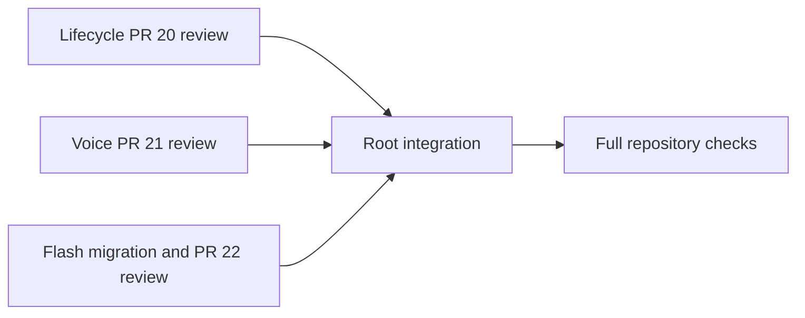

# Flash maintenance contract

ALLOW: integrate reviewed fixes from PRs 20–22 locally; migrate the picker and router to one DeepSeek Flash model; update affected tests and documentation.

FREEZE: macOS and Windows support; authenticated loopback routing; protected credentials; provider state and legacy thread compatibility. No changes to the active installation or release publication. The initial implementation was local-only; the user subsequently authorized committing and pushing the reviewed changes to main.

ACCEPT: `npm test`, `git diff --check`, targeted lifecycle fault injection, model alias/catalog migration, native image forwarding, and provider-switch replay regression coverage. Windows-only tests skipped on macOS remain explicitly unverified.

| Work package | Owner / branch / worktree | Files | Interface | Acceptance |
| --- | --- | --- | --- | --- |
| A | lifecycle agent; codex/review-lifecycle; isolated lifecycle worktree | PR 20 lifecycle files and regression tests | CLI start/stop/autostart, catalog readiness | lifecycle tests and rollback failure injection |
| B | voice agent; codex/review-voice; isolated voice worktree | PR 21 review only | GPT live request forwarding and replay normalization | focused proxy tests and actionable diff review |
| C | root; codex/flash-maintenance; project checkout | constants, catalog, proxy, model tests, docs | single Flash picker; legacy aliases; native vision | targeted tests |
| D/E | root only | integration checkout | reviewed patches, no remote mutations | npm test; git diff --check |

Independent reviews run concurrently. Only the root integrates patches; agents do not commit or touch the main checkout.

## Local integration evidence

- PR refs fetched: #20 `be92141`, #21 `9898eaa`, #22 `fc6705c`.
- PR #20 integrated as a reviewed patch, with a regression fix: failed rollback cleanup must still attempt manual-router restoration. The isolated test fails on the original PR and passes after the fix.
- PR #21 deferred: multipart Live requests bypass `maxDecodedBytes`; its global custom-provider change still needs real client acceptance. Its own suite passed 125 tests with 2 Windows skips; that does not resolve these gaps.
- PR #22 contains documentation changes only. This branch implements foreign GPT replay cleanup and covers compressed requests, native GPT byte preservation, and valid/invalid DSCodex compaction replay.
- Full integrated suite: 113 tests, 107 pass, 0 fail, 6 Windows-native skips (macOS, Node 26.8.1). `git diff --check` passed. Added a Node 24 CI matrix for macOS, Windows and Linux; it has not run remotely.
- Real isolated Codex / Flash Max smoke: exit 0, exactly one completed shell command, output and final response `DSCODEX_FLASH_SMOKE_OK`. No active installation configuration was modified.
- At integration time the release version stayed at 1.1.0 and no release was published; main-branch publication was authorized after local acceptance.
- Real native-vision smoke: isolated Codex made two Flash requests; the second contained one `input_image` inside the tool-result history. Flash correctly returned `red blue` for a synthetic left-red/right-blue PNG. No GPT vision request was made. The CLI JSON event stream does not expose `view_image` as a command event, so image delivery was verified at the router's outgoing request boundary instead.
- The isolated CLI logged a featured-plugin cache warning; it did not affect either tool-loop result. Real GPT/Voice calls and Windows-native runtime acceptance remain unverified.

## Closure

- Released as v1.2.0 "From the New World" (`ea41e47`, tag `v1.2.0`, 2026-09-11); #17 closed. Release notes: `docs/releases/v1.2.0.md`.
- Follow-up `d519ff2` added `llms.txt`, `llms-full.txt`, `CITATION.cff`, and FAQ disambiguation for search and model citation.
- Juice check (2026-09-11): the hosted Responses API rejects integer 1–100 and `ultra` with HTTP 400; the High / Max mapping (`high` = 75, `max` = 100) stands unchanged.
- Still open: Voice PR #21 acceptance; Windows runtime acceptance on real hardware.
